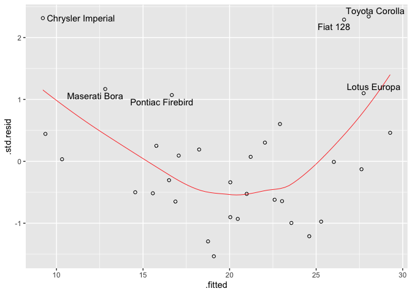
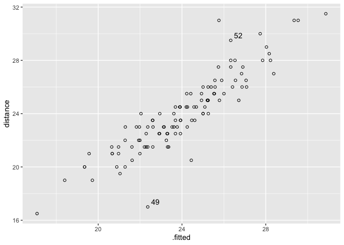

<!-- README.md is generated from README.Rmd. Please edit that file -->

# diagnoser

<!-- badges: start -->
<!-- badges: end -->

The goal of diagnoser is to make it easy to diagnose regression models,
`lm`, `lme`, or `lmer`. A great package `car` can do this, but
`diagnoser` produces diagnosis plots using `ggplot2`.

## Installation

You can install the development version of diagnoser from
[GitHub](https://github.com/) with:

``` r
# install.packages("devtools")
devtools::install_github("i-kiwamu/diagnoser")
```

## Example 1: lm

First of all, make an object of diagnosis.

``` r
library(ggplot2)
library(diagnoser)

# lm for mtcars
lm_mtcars <- lm(mpg ~ disp + hp + wt, mtcars)
diag_lm_mtcars <- diagnose(lm_mtcars)
```

### Measured vs fitted plot

``` r
plot(diag_lm_mtcars, type = "mf")
```


Data with text show Cook’s distance \> 0.05.

### Residuals vs fitted

``` r
plot(diag_lm_mtcars, type = "rf")
```



### Marginal-model plot

``` r
plot(diag_lm_mtcars, type = "mm", aes(x = hp))
```


### Added-variable plot

``` r
plot(diag_lm_mtcars, type = "av", aes(x = hp))
```


### Component+Residuals plot

``` r
plot(diag_lm_mtcars, type = "cr", aes(x = hp))
```


## Example 2: lme

``` r
library(nlme)
lme_od <- lme(distance ~ age + Sex, Orthodont, random = ~ 1 | Subject)
diag_lme_od <- diagnose(lme_od)
```

### Measured vs fitted

``` r
plot(diag_lme_od, type = "mf")
```



### Residuals vs fitted

``` r
plot(diag_lme_od, type = "rf")
```


### QQ norm

``` r
plot(diag_lme_od, type = "qq")
```


### QQ norm for random effects

``` r
plot(diag_lme_od, type = "qq", aes(sample = .ranef.intercept), level = "Subject")
```


<!-- You'll still need to render `README.Rmd` regularly, to keep `README.md` up-to-date. `devtools::build_readme()` is handy for this. You could also use GitHub Actions to re-render `README.Rmd` every time you push. An example workflow can be found here: <https://github.com/r-lib/actions/tree/v1/examples>.
&#10;You can also embed plots, for example:
&#10;
```r
plot(pressure)
```
&#10;
&#10;In that case, don't forget to commit and push the resulting figure files, so they display on GitHub and CRAN.
-->
